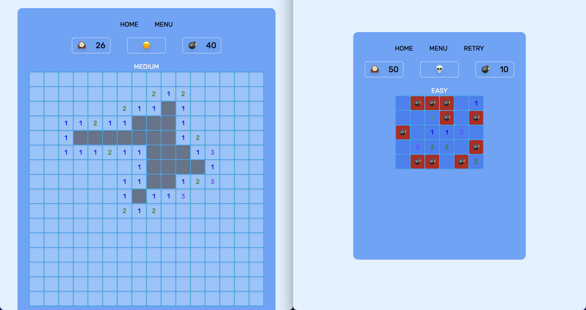

## 지뢰 찾기 게임



추억의 지뢰 찾기 게임입니다. Easy, Medium, Hard, Extream 4가지의 모드를 경험해볼 수 있고, 웹 브라우저, 모바일에서 게임을 즐길 수 있습니다.

<br />

### Table of contents

- [Build & Installation](https://github.com/h-alex2/minesweeper#build--installation)
- [Introduction](https://github.com/h-alex2/minesweeper#introduction)
- [Goal](https://github.com/h-alex2/minesweeper#goal)
- [Motivation](https://github.com/h-alex2/minesweeper#motivation)
- [기술 스택](https://github.com/h-alex2/minesweeper#%EA%B8%B0%EC%88%A0-%EC%8A%A4%ED%83%9D)
- [Schedule](https://github.com/h-alex2/minesweeper#schedule)
- [Feature](https://github.com/h-alex2/minesweeper#feature)
- [배운 점과 느낀 점](https://github.com/h-alex2/minesweeper#%EB%B0%B0%EC%9A%B4-%EC%A0%90%EA%B3%BC-%EB%8A%90%EB%82%80-%EC%A0%90)
- [아쉬운 점](https://github.com/h-alex2/minesweeper#%EC%95%84%EC%89%AC%EC%9A%B4-%EC%A0%90)

<br />

## Build & Installation

[배포 사이트로 가기](https://minesweeper-by-alex.netlify.app/)

```js
npm install
npm start
```

<br />

## Introduction

`React`의 `Class component`와 `React-Redux` `connect(mapStateToProps, mapDispatchToProps)`를 사용한 프로젝트입니다.

<br />

## Goal

현재 권장하는 방법이 아닌 이전에 많이 썼던 방법을 경험해봄으로써 React와 Redux가 어떤 방향으로 업데이트되고 어떤 점을 개선했는지 더 이해할 수 있는 것을 목표로 설정했습니다. 그리고 함수형 컴포넌트와 Redux 툴킷 사용을 주로 하면서 놓쳤던 기본기를 다지는 것도 함께 목표로 설정하였습니다.

<br />

## Motivation

React에 대해서 알아보다 보면 Class 컴포넌트와 함수형 컴포넌트를 비교하며 설명하는 글이 많았습니다. 함수형 컴포넌트를 주로 쓰다 보니 Class 컴포넌트와의 비교가 잘 와 닿지 않는 부분이 생겨 그 틈을 메꾸고자 Class 컴포넌트를 사용한 미니 프로젝트를 진행하게 되었습니다. 이전에 사용했던 방식을 경험해보고 나면, 지금의 방법과 이전의 방법의 차이를 더 명확히 알 수 있을 것 같아 좋은 경험이 될 것으로 생각했습니다.

<br />

## 기술 스택

- `React 18`, `cra(create-react-app)`를 활용했습니다.
- `React Router Dom`을 이용해 라우팅을 처리했습니다.
- `Redux`, `React-Redux` 전역 상태 관리 툴을 이용하였습니다.
- `Tailwind` CSS 프레임워크를 사용하였습니다.

  | Dependencies     | Version |
  | ---------------- | ------- |
  | react            | ^18.2.0 |
  | react-redux      | ^8.0.5  |
  | redux            | ^4.2.0  |
  | react-router-dom | ^6.7.0  |
  | tailwindcss      | ^3.2.4  |

<br />

## Schedule

| Date     | Schedule                           |
| -------- | ---------------------------------- |
| 23.01.23 | 스케줄 설정 및 기능 구현 방법 탐색 |
| 23.01.24 | 기능 구현                          |
| 23.01.25 | 기능 구현                          |
| 23.01.25 | 버그 수정, 배포                    |
| 23.01.26 | 버그 수정                          |

<br />

## Feature

### 상태 관리

```js
// status reducer
const initialState = {
  gameStatus: GAME_STATUS.START,
  mode: "easy",
  table: [],
  row: 0,
  col: 0,
  minesCount: 0,
  minesIndexObj: {},
  finishCellCount: 0,
};

...
// base reducer
const initialState = {
  isModalShowing: false,
};
```

- 게임과 관련된 상태, 관련되지 않은 상태 두 가지로 나누어 상태 관리를 해주었습니다.
- `minesIndexObj`: 지뢰가 위치한 index를 object에 기록해주었습니다. 빠른 탐색을 위해 배열이 아닌 객체를 선택했습니다.

<br />

### 지뢰 생성

```js
import React from "react";
import { useParams } from "react-router-dom";

const withParams = Child => {
  return function hoc(props) {
    const params = useParams();

    return <Child {...props} params={params} />;
  };
};

export default withParams;
```

- 선택한 게임 모드에 맞는 지뢰 개수로 랜덤 난수를 생성합니다. 유저가 처음 셀을 클릭했을 때 지뢰를 생성합니다. 사용자 경험을 위해 처음 선택된 셀은 랜덤 난수에서 제외했습니다. 선택한 게임 모드는 상태 관리 하지 않고 `params`를 이용해 `action`의 인자로 전달했습니다. `class component`에서 `react router`의 `useParams` 훅을 사용하기 위해 `withParams`라는 `HOC`를 만들어 사용했습니다.

<br />

### 클릭한 셀 주위 탐색 (DFS 활용)

- 유저가 클릭한 셀이 지뢰가 아닐 경우 주위 지뢰 개수를 표시하고, 주위에 지뢰가 없으면 지뢰가 있는 곳까지 셀을 열어줍니다. DFS 알고리즘을 이용해 주위 셀 하나를 확인하고 주위에 지뢰가 있을 때까지 깊이 탐색한 후 탐색을 마치면 다음 셀을 탐색하는 방법을 적용했습니다.

1. 클릭한 셀의 주위 셀 데이터를 `aroundCellData`라는 배열에 push 합니다.
2. aroundCellData을 순회하며 하나씩 pop해준 후 cell이 지뢰인지 빈 셀인지 확인하고 빈 셀이라면 `aroundEmptyCellArray` 배열에 push해줍니다.
3. `aroundEmptyCellArray` 배열의 개수가 8개라면 주위 셀이 다 비어있는 것이므로 forEach를 이용해 재귀를 실행시킵니다.
4. `aroundEmptyCellArray` 배열의 개수가 8개가 아니라면 주위 셀에 지뢰가 있는 것이므로 `aroundEmptyCellArray` 배열의 지뢰 개수를 판별해 클릭한 셀의 데이터로 입력합니다.

<br />

> 어려웠던 점

<br />

- 셀이 중간에 있는 경우 위 셀, 양옆의 셀, 아래 셀이 모두 존재하지만, 셀이 제일 위, 아래, 왼쪽, 오른쪽에 있는 경우 주위 셀 개수가 8개가 아니게 되는 부분을 처리하는 게 생각보다 어려웠습니다. `outsideCellCount`이라는 변수를 만들어 셀이 없는 개수를 체크해 조건문으로 처리해서 해결했습니다.

<br />

### Cell Flag 상수로 정의

```js
const FLAG = {
  MINE: -1,
  AROUND_ALL_EMPTY: 9,
  EMPTY: 10,
  OPENED: 11,
  QUESTION_MARK: 12,
  MINE_FLAG: 13,
};
```

- 셀의 데이터 타입을 숫자로 정의했습니다. 명시적인 코드를 작성하기 위해 flag를 상수로 처리하였습니다.

<br />

### 셀 컴포넌트 최적화

- `PureComponent`를 사용하여 최적화를 해보았습니다. 셀 컴포넌트인 TD 컴포넌트에 적용해 변경된 컴포넌트만 리렌더링 되도록 해주었습니다.

<br />

## 배운 점과 느낀 점

- `class`에 대해서 조금 더 친숙하게 느껴지는 계기가 되었습니다. `class` 문법이 익숙하지 않아 눈에 잘 들어오지 않았는데 이제는 프로젝트 전보다 익숙하게 사용할 수 있게 되었습니다.
- 함수형 컴포넌트에서 `useEffect`만 매번 쓰다가 `class` 컴포넌트의 라이프 사이클을 다루는 메서드들을 쓰니 색달랐습니다. `class` 컴포넌트라서 좀 더 불편할 줄 알았는데 생각보다 메서드 명들이 명확하여 `useEffect`보다 이해하기 쉬웠습니다.
- `Redux toolkit`을 쓰지 않고, 기본형을 그대로 쓰다 보니 많은 보일러플레이트가 생기게 됐는데, 개념을 좀 더 이해하고 사용하다 보니 크게 거슬리지 않았습니다. 이제는 오히려 더 명확한 느낌이 들었고 그전엔 제대로 알고 사용한 게 아니라는 생각이 들었습니다.

<br />

## 아쉬운 점

- 프로젝트 기간을 짧게 설정하여 UI와 기능들의 디테일을 더 살리지 못한 점이 아쉬웠습니다. 하지만 처음 기획했던 프로젝트 목표는 달성하여 추후에 조금씩 더 업데이트를 해보고자 합니다.
- `container-presenter`패턴을 적용하기 위해 시도했지만, `container`로 분리한 컴포넌트를 아직 완벽히 추상화하지 못한 점이 아쉬웠습니다. 컴포넌트 내에 스타일과 마크업이 함께 들어가 있어 좀 더 분리가 필요할 것 같습니다.
- `class` 컴포넌트에서 함수, 변수를 메모이제이션 하여 최적화하지 못한 점이 아쉬웠습니다. `PureComponent`를 사용하긴 했으나 아직도 많은 렌더링이 일어나 셀이 많은 Extream 모드에서는 화면을 줄일 때 버벅임이 심합니다. 이 부분에 대해서는 좀 더 고민하여 업데이트 해야 할 것 같습니다.
- `tailwind`를 이번에 처음 사용해보았는데 익힐 시간이 적어 `tailwind`의 장점을 제대로 사용해보지 못한 점이 아쉬웠습니다. 아직은 깔끔하게 스타일 적용이 잘되지 않아서 어려운 부분이 많았는데, 적응 이후에는 custom class 등 모듈화할 수 있다는 장점을 잘 사용할 수 있을 것 같아 한편으로는 기대되는 마음이 들게 되었습니다. 좀 더 정리하는 시간을 가진 후 사용해보고자 합니다.
